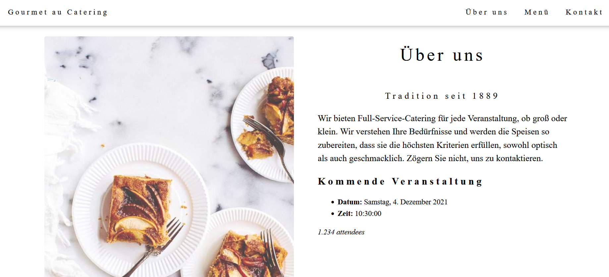

# falcon-i18n
Learn to build a multilingual web application using Falcon framework. Utilizing Jinja2 and Babel to implement the following features:
* message catalog
* interpolation
* custom filters
* number formatting
* date date_formatting
* time formatting
* pluralization
* i18n restful URL

## Setup
The folder structure for this tutorial is as follows:

```
├── locales
│   ├── en
│   └── de
├── templates
|   └── index.html
├── main.py
├── babel.cfg
└── requirements.txt
```

For your information, this tutorial is based on Python3. Highly recommended to create a virtual environment before the installation

Run the following command in your terminal:

```
pip install falcon
pip install babel
pip install jinja2
pip install uvicorn
```

Alternatively, install via `requirements.txt`:

    pip install -r requirements.txt


## Message Catalogs
Babel configuration for custom extrator:

```
[python: **.py]
encoding = utf-8
[jinja2: **/templates/**.html]
encoding = utf-8
extensions=jinja2.ext.autoescape,jinja2.ext.with_
```

Run the following command for extraction

    pybabel extract -F babel.cfg -o locales/messages.pot templates/

Initialization for all the supported locales:

    pybabel init -l en -i locales/messages.pot -d locales
    pybabel init -l de -i locales/messages.pot -d locales

You can use the update command to make changes to existing translation files:

    pybabel extract -F babel.cfg -o locales/messages.pot templates/
    pybabel update -i locales/messages.pot -d locales


Finally, compile it into machine-readable files:

    pybabel compile -d locales

## HTML
This tutorial uses the lite version of a [HTML template made by W3.CSS](https://www.w3schools.com/w3css/tryw3css_templates_gourmet_catering.htm)


## Server code
Complete code for Falcon server

```py
import falcon
import falcon.asgi
import jinja2
import datetime
import gettext
import os
from babel.dates import format_date, format_time
from babel.numbers import format_decimal

app = falcon.asgi.App()
translations = {}
default_fallback = 'en'
env = jinja2.Environment(extensions=['jinja2.ext.i18n', 'jinja2.ext.with_'], loader=jinja2.FileSystemLoader('templates'))

base_dir = 'locales'
supported_langs = [x for x in os.listdir(base_dir) if os.path.isdir(os.path.join(base_dir, x))]

for lang in supported_langs:
    translations[lang] = gettext.translation('messages', localedir='locales', languages=[lang])

env.install_gettext_translations(translations[default_fallback])


def num_filter(input, locale):
    return format_decimal(input, locale=locale)


def date_filter(input, locale):
    return format_date(input, format='full', locale=locale)


def time_filter(input, locale):
    return format_time(input, locale=locale)


env.filters['num_filter'] = num_filter
env.filters['date_filter'] = date_filter
env.filters['time_filter'] = time_filter


class ExampleResource:
    async def on_get(self, req, resp, locale):
        if(locale not in supported_langs):
            locale = default_fallback

        env.install_gettext_translations(translations[locale])

        # mock data
        data = {
            "event_attendee": 1234,
            "event_date": datetime.date(2021, 12, 4),
            "event_time": datetime.time(10, 30, 0)
        }

        resp.status = falcon.HTTP_200
        resp.content_type = 'text/html'
        template = env.get_template("index.html")
        resp.text = template.render(**data, locale=locale)


class RedirectResource:
    async def on_get(self, req, resp):
        raise falcon.HTTPFound(req.prefix + '/en/main')


example = ExampleResource()
redirect = RedirectResource()

app.add_route('/{locale}/main', example)
app.add_route('/', redirect)
```

Run the server as follows:

    uvicorn main:app

Access the web application at the following url:

    # English
    http://localhost:8000/en/main

    # German
    http://localhost:8000/de/main

Example user interface for German


